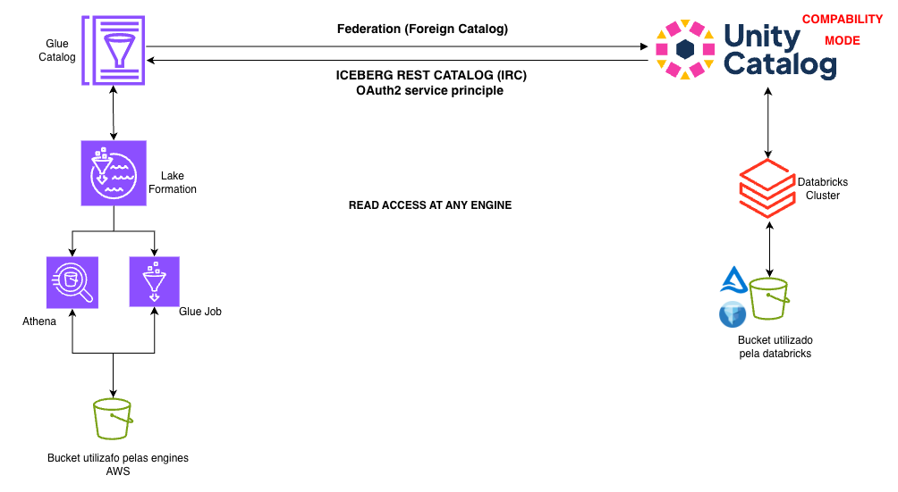

# Databricks Unity Catalog ⇄ AWS Glue Data Catalog — Federação Bidirecional

Referência completa e **funcional** de **federação de catálogo bidirecional** entre o
**Databricks Unity Catalog (UC)** e o **AWS Glue Data Catalog**, governada pelo **AWS Lake
Formation** — fazendo as tabelas fluírem **nos dois sentidos**, sem copiar dados e sem crawlers.

Construído e validado num ambiente real de Databricks-on-AWS e depois genericizado neste template.



---

## As duas direções

| # | Direção | O que faz | Recurso Databricks | Quando usar |
|---|---------|-----------|--------------------|-------------|
| **01** | **AWS Glue → Unity Catalog** *(primária)* | Uma **tabela nativa do Glue** (criada fora do Databricks) fica legível **dentro do UC** | Lakehouse / Hive Metastore **federation** (`CREATE CONNECTION TYPE glue` + foreign catalog) | É a federação que os clientes costumam fazer **primeiro** — trazer dados existentes do Glue/AWS para o lakehouse |
| **02** | **Unity Catalog → AWS Glue** *(reversa)* | As **tabelas do UC** ficam descobríveis/consultáveis **dentro do Glue** (Athena, Redshift, EMR, SageMaker) | **Catalog federation** do AWS Glue para o Databricks via **Iceberg REST Catalog (IRC)** do UC | Expor dados **governados** do UC para engines nativas da AWS, somente leitura |

Ambas mantêm o **Unity Catalog como fonte de verdade** e usam o **Lake Formation** para controle
de acesso fino do lado AWS. O acesso pelo lado AWS é **somente leitura**.

### Peças de apoio
- **03 – Compatibility Mode** — torna **streaming tables, materialized views e managed tables** do UC
  legíveis como **Iceberg/Delta** (pré-requisito para expô-las pela direção **02**).
- **04 – Acesso nativo via Athena** — uma **alternativa** à direção 02: registrar a saída do
  Compatibility Mode como **tabelas nativas do Glue** e lê-las pelo Athena (atenção: isso **ignora a
  governança do UC** no caminho de leitura na AWS — a federação 02 é a opção governada).

---

## Estrutura do repositório

```
.
├── 01-glue-to-unity-catalog/      # PRIMÁRIA: tabela nativa do Glue → UC (federação)
│   ├── README.md                  #   passo a passo (Glue job + foreign catalog no UC)
│   ├── glue_job_fx_rates.py       #   Glue job PySpark que cria a tabela nativa
│   └── iam/                       #   JSON de role/policy/trust (Glue job + service credential do UC)
├── 02-unity-catalog-to-glue/      # REVERSA: tabelas do UC → Glue via Iceberg REST Catalog
│   ├── README.md
│   └── iam/
├── 03-compatibility-mode/         # Pré-req da 02: pipeline SDP medallion + exemplo de managed table
│   ├── README.md
│   ├── medallion_pipeline.py
│   └── compatibility_mode_managed_table.py
├── 04-athena-native-access/       # Caminho alternativo na AWS (tabelas nativas no Glue via Athena + boto3)
│   ├── README.md
│   ├── athena_register_glue.py
│   └── iam/
└── diagrams/architecture.png
```

O `README.md` de cada pasta é um guia completo e prático (UI + CLI) daquela peça.

---

## Pré-requisitos

- Um workspace **Databricks on AWS** com **Unity Catalog** (admin do metastore para criar
  connections, credentials e habilitar o *external data access*).
- Uma **conta AWS** com **Glue Data Catalog** + **Lake Formation** (você precisará ser admin do Lake
  Formation para conceder permissões — veja a nota sobre *Lake Formation* abaixo).
- CLIs: **Databricks CLI** (um profile configurado) e **AWS CLI** (um profile configurado).

## Ordem sugerida

1. **01 – Glue → Unity Catalog** (comece aqui; traga dados nativos do Glue para o UC).
2. **03 – Compatibility Mode** e depois **02 – Unity Catalog → Glue** (exponha dados do UC para a AWS).
3. **04 – Acesso nativo via Athena** se você precisar de tabelas nativas do Glue em vez de federação.

## Configuração — substitua estes placeholders

Os guias usam valores de exemplo/placeholder — troque pelos seus:

| Placeholder / exemplo | Substituir por |
|---|---|
| `111122223333` | seu **AWS account ID** |
| `<WORKSPACE_HOST>` | o host do seu workspace Databricks (ex.: `dbc-xxxx.cloud.databricks.com`) |
| `<EXTERNAL_ID>` | o **external ID** retornado ao criar a credential no UC |
| `demo_poc`, `demo-*`, `databricks-demo-*` | seus nomes de catálogo / external location / service principal |
| buckets/roles `gabrielrangel-*` | seus próprios buckets S3 / nomes de IAM role |

> ⚠️ **Lake Formation (modo estrito):** se a sua conta usa Lake Formation, permissões IAM **não
> bastam** — os principals (o role do Glue job **e** o role da federação do UC) também precisam de
> grants LF (`DESCRIBE` no `default`, `CREATE_TABLE`/`SELECT`/`DESCRIBE` nos databases/tabelas). Cada
> guia indica exatamente onde.

---

## Referências (documentação oficial)

**Databricks**
- Unity Catalog Iceberg REST Catalog (acesso externo) — https://docs.databricks.com/aws/en/external-access/iceberg
- Habilitar *external data access* no metastore — https://docs.databricks.com/aws/en/external-access/admin
- Integrações de acesso externo (clientes/engines) — https://docs.databricks.com/aws/en/external-access/integrations
- Credential vending — https://docs.databricks.com/aws/en/external-access/credential-vending
- UniForm / External Iceberg Reads — https://docs.databricks.com/aws/en/delta/uniform
- Compatibility Mode — https://docs.databricks.com/aws/en/external-access/compatibility-mode
- Lakeflow Spark Declarative Pipelines — https://docs.databricks.com/aws/en/ldp/
- Lakehouse/HMS federation para AWS Glue — https://docs.databricks.com/aws/en/query-federation/hms-federation-glue
- Catalog federation (visão geral) — https://docs.databricks.com/aws/en/query-federation/catalog-federation
- Criar service credentials — https://docs.databricks.com/aws/en/connect/unity-catalog/cloud-services/service-credentials
- Usar service credentials (boto3) — https://docs.databricks.com/aws/en/connect/unity-catalog/cloud-services/use-service-credentials
- Storage credential + external location (S3) — https://docs.databricks.com/aws/en/connect/unity-catalog/cloud-storage/s3/s3-external-location-manual

**AWS**
- Lake Formation — *Federate to Databricks Unity Catalog* — https://docs.aws.amazon.com/lake-formation/latest/dg/catalog-federation-databricks.html
- Lake Formation — *Creating a federated catalog using an AWS Glue connection* — https://docs.aws.amazon.com/lake-formation/latest/dg/create-fed-catalog-data-source.html
- Lake Formation — *Catalog federation to remote Iceberg catalogs* — https://docs.aws.amazon.com/lake-formation/latest/dg/catalog-federation.html
- Amazon Athena — *Query Delta Lake tables* — https://docs.aws.amazon.com/athena/latest/ug/delta-lake-tables.html
- AWS Big Data Blog — *Access Databricks Unity Catalog data using catalog federation in the AWS Glue Data Catalog* — https://aws.amazon.com/blogs/big-data/access-databricks-unity-catalog-data-using-catalog-federation-in-the-aws-glue-data-catalog/

---

## Autor

**Gabriel Rangel** — Solutions Engineer, Databricks.

> Este repositório foi genericizado a partir de uma prova de conceito real; referências ao cliente
> foram removidas e identificadores específicos do ambiente substituídos por placeholders. Use como
> template.
