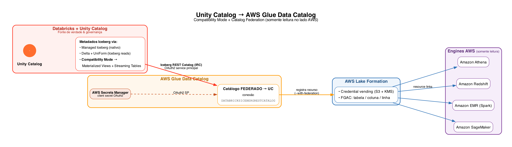

# Databricks Unity Catalog ⇄ AWS Glue Data Catalog — Bi‑directional Federation

End‑to‑end, working reference for **bi‑directional catalog federation** between **Databricks
Unity Catalog (UC)** and the **AWS Glue Data Catalog**, governed by **AWS Lake Formation** — so
tables flow **both ways** without copying data or running crawlers.

Built and validated on a real Databricks‑on‑AWS environment, then genericized into this template.



---

## The two directions

| # | Direction | What it does | Databricks feature | When |
|---|-----------|--------------|--------------------|------|
| **01** | **AWS Glue → Unity Catalog** *(primary)* | A **native Glue table** (created outside Databricks) becomes readable **inside UC** | Lakehouse / Hive Metastore **federation** (`CREATE CONNECTION TYPE glue` + foreign catalog) | The federation customers usually run **first** — bring existing Glue/AWS data into the lakehouse |
| **02** | **Unity Catalog → AWS Glue** *(reverse)* | **UC tables** become discoverable/queryable **inside Glue** (Athena, Redshift, EMR, SageMaker) | AWS Glue **catalog federation to Databricks** via the Unity Catalog **Iceberg REST Catalog (IRC)** | Expose **governed** UC data to AWS‑native engines, read‑only |

Both keep **Unity Catalog as the source of truth** and use **Lake Formation** for fine‑grained
access control on the AWS side. AWS‑side access is **read‑only**.

### Supporting pieces
- **03 – Compatibility Mode** — makes UC **streaming tables, materialized views and managed tables**
  readable as **Iceberg/Delta** (a prerequisite for exposing them through direction **02**).
- **04 – Athena native access** — an **alternative** to direction 02: register the Compatibility‑Mode
  output as **native Glue tables** and read them from Athena (note: this bypasses UC governance on
  the AWS read path — federation 02 is the governed option).

---

## Repository structure

```
.
├── 01-glue-to-unity-catalog/      # PRIMARY: native Glue table → UC (federation)
│   ├── README.md                  #   step-by-step (Glue job + UC foreign catalog)
│   ├── glue_job_fx_rates.py       #   Glue PySpark job that creates the native table
│   └── iam/                       #   IAM role/policy/trust JSON (Glue job + UC service credential)
├── 02-unity-catalog-to-glue/      # REVERSE: UC tables → Glue via Iceberg REST Catalog
│   ├── README.md
│   └── iam/
├── 03-compatibility-mode/         # Prereq for 02: SDP medallion pipeline + managed-table example
│   ├── README.md
│   ├── medallion_pipeline.py
│   └── compatibility_mode_managed_table.py
├── 04-athena-native-access/       # Alternative AWS read path (native Glue tables via Athena + boto3)
│   ├── README.md
│   ├── athena_register_glue.py
│   └── iam/
└── diagrams/architecture.png
```

Each folder's `README.md` is a complete, hands‑on guide (UI + CLI) for that piece.

---

## Prerequisites

- A **Databricks on AWS** workspace with **Unity Catalog** (metastore admin to create connections,
  credentials and to enable *external data access*).
- An **AWS account** with **Glue Data Catalog** + **Lake Formation** (you'll need Lake Formation
  admin to grant permissions — see the *Lake Formation* note below).
- CLIs: **Databricks CLI** (a configured profile) and **AWS CLI** (a configured profile).

## Suggested order

1. **01 – Glue → Unity Catalog** (start here; bring native Glue data into UC).
2. **03 – Compatibility Mode** then **02 – Unity Catalog → Glue** (expose UC data to AWS).
3. **04 – Athena native access** if you need native Glue tables instead of federation.

## Configuration — replace these placeholders

The guides use example/placeholder values — substitute your own:

| Placeholder / example | Replace with |
|---|---|
| `111122223333` | your **AWS account ID** |
| `<WORKSPACE_HOST>` | your Databricks workspace host (e.g. `dbc-xxxx.cloud.databricks.com`) |
| `<EXTERNAL_ID>` | the **external ID** returned when you create the UC credential |
| `demo_poc`, `demo-*`, `databricks-demo-*` | your catalog / external‑location / service‑principal names |
| `gabrielrangel-*` buckets/roles | your own S3 buckets / IAM role names |

> ⚠️ **Lake Formation (strict mode):** if your account enforces Lake Formation, IAM permissions are
> **not enough** — the principals (the Glue job role **and** the UC federation role) also need LF
> grants (`DESCRIBE` on `default`, `CREATE_TABLE`/`SELECT`/`DESCRIBE` on the databases/tables). Each
> guide calls out exactly where.

---

## Author

**Gabriel Rangel** — Solutions Engineer, Databricks.